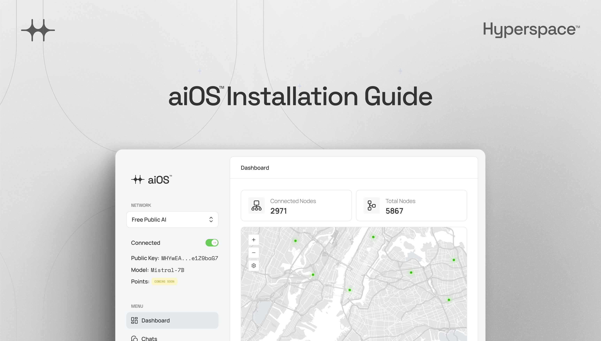

# aiOS: Revolutionize AI Accessibility.



**The world’s first decentralized AI network for Mistral7B-based model.**

Download the Alpha Release: The Hyperspace node is available for Windows, Linux, and macOS users in its early alpha stages. Embark on this pioneering journey by downloading the app and be among the first to experience the forefront of decentralized AI computing.

As an alpha version, the app is in its initial development phase and we welcome user feedback to enhance its functionality.

## Available Platforms

- macOS (Intel x86_64 and Apple Silicon)
- Windows (x86_64)
- Linux (Ubuntu, x86_64, AppImage format)

## Download

All downloads for macOS and Windows are available from [aiOS™ website](https://aios.network/)

For Linux, the AppImage is available in the GitHub Releases.

## How to Install and Run aiOS Node

### macOS

To install the Hyperspace Node on macOS:

1. Download the macOS installer for [Apple Silicon](https://aios.network/dl/mac) or [Apple Intel](https://aios.network/dl/mac-intel).
2. Open the downloaded DMG file.
3. Drag the Hyperspace application to your Applications folder.
4. Launch the Hyperspace Node application from the Applications folder.

### Windows

> [!IMPORTANT]
>
> Our Windows application is currently in the process of obtaining code signing certification. Users may encounter security warnings or errors when attempting to run the application. We are actively working on resolving this issue

To install the Hyperspace Node on Windows:

1. Download the Windows installer for [x86_64](https://aios.network/dl/win).
2. Run the installer and follow the on-screen instructions.
3. Launch the Hyperspace Node application.

### Linux (Ubuntu)

To install the Hyperspace Node on Linux (Ubuntu) using the AppImage:

1. Download the latest AppImage from [Releases](https://github.com/hyperspaceai/hyperspace-node/releases).
2. Open a terminal and navigate to the directory where the AppImage is located.
3. Make the AppImage executable by running the following command:

```bash
chmod +x Hyperspace-x86\_64.AppImage
```

4. Run the AppImage:

```bash
./Hyperspace-x86\_64.AppImage
```

## Contact Us


For any issues, concerns, or questions about this process, please reach out to us on [X (formerly Twitter)](https://twitter.com/HyperspaceAI).
