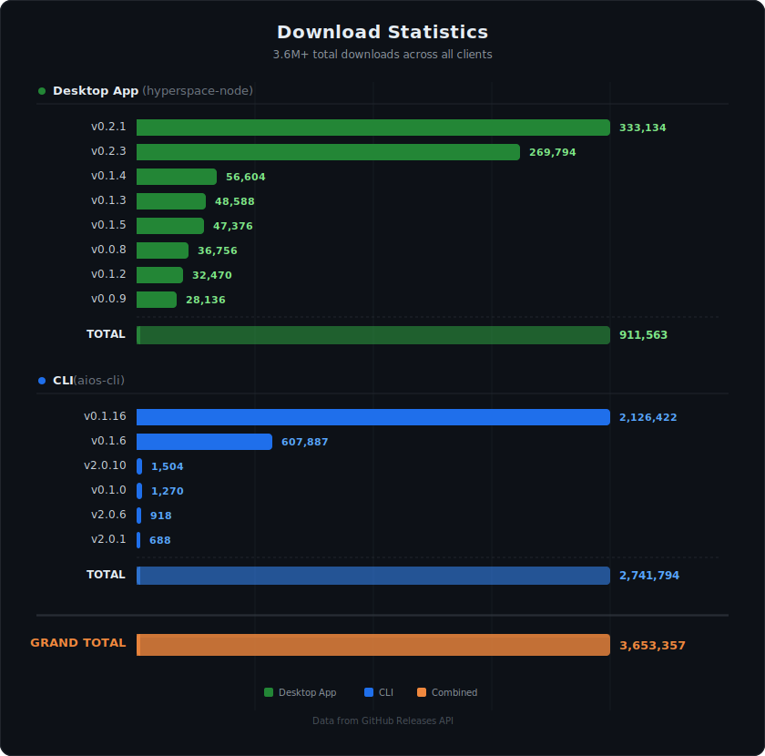

# Hyperspace


**The world's largest decentralized P2P AI inference network -- 2,000,000+ agents and counting.**

Hyperspace is a fully decentralized peer-to-peer network for AI inference, built on [libp2p](https://libp2p.io/) (the same protocol stack that powers IPFS). There are no central servers. Every agent connects directly to other agents, discovers peers via DHT, and communicates through GossipSub. You contribute compute, storage, or bandwidth -- and earn points for it.

- **Website:** [https://hyper.space](https://hyper.space)
- **Dashboard:** [https://p2p.hyper.space](https://p2p.hyper.space)
- **Network Stats:** [https://network.hyper.space](https://network.hyper.space)
- **X / Twitter:** [@HyperspaceAI](https://x.com/HyperspaceAI)

---

## Downloads

<p align="center">
  
</p>

---

## Quick Start

Install and start an agent in two commands:

```bash
curl -fsSL https://download.hyper.space/api/install | bash
hyperspace start
```

---

## Table of Contents

- [Installation](#installation)
- [Client Comparison](#client-comparison)
- [CLI Command Reference](#cli-command-reference)
- [Network Capabilities](#network-capabilities)
- [Architecture](#architecture)
- [Points System](#points-system)
- [Pulse Verification](#pulse-verification)
- [Supported Platforms](#supported-platforms)
- [Migrating from v1](#migrating-from-v1)
- [Troubleshooting](#troubleshooting)
- [License](#license)

---

## Installation

There are four ways to run a Hyperspace agent. Choose the one that fits your setup.

### 1. One-Line Install (Recommended)

```bash
curl -fsSL https://download.hyper.space/api/install | bash
```

This auto-detects your platform and environment:

- **Desktop machines** (macOS, Linux with GUI, Windows): Installs both the CLI and the Tray App.
- **Headless servers** (no display): Installs the CLI only.
- Use `--no-tray` to skip tray app installation on desktop machines.

The installer also sets up `llama-server` for native GPU inference and integrates with any existing [Ollama](https://ollama.com) installation.

### 2. Tray App (Desktop Users)

The tray app is a lightweight system tray controller that manages the CLI agent as a background process. It survives reboots, shows real-time stats, and auto-updates.

The install script above handles tray app installation automatically:

- `.dmg` on macOS
- `.deb` on Linux
- `.exe` / `.msi` on Windows

You can also download the tray app manually from the [latest release](https://github.com/hyperspaceai/hyperspace-node/releases/latest).

### 3. CLI Only (Headless Servers)

```bash
curl -fsSL https://download.hyper.space/api/install | bash -s -- --no-tray
```

The CLI runs as a background daemon. Recommended for cloud VMs, dedicated GPU servers, and headless machines.

### 4. Browser

Visit [https://p2p.hyper.space](https://p2p.hyper.space) -- no installation required. Runs entirely in your browser using WebGPU and WebLLM.

---

## Client Comparison

| Feature | Browser | CLI Agent | Tray App |
|---------|---------|-----------|----------|
| GPU Access | WebGPU (limited) | Full native GPU | Full native GPU (via CLI sidecar) |
| Models | WebLLM only | GGUF up to 32B params | GGUF up to 32B params |
| Uptime | Tab must stay open | Background daemon | System tray -- survives reboot |
| Inference Speed | ~10-20 tok/s | ~40-80 tok/s (CUDA) | ~40-80 tok/s (CUDA) |
| Ollama Support | No | Yes | Yes |
| Setup | Zero-install | One command | One command (auto-installed) |
| Auto-Update | Always latest | On start | Built-in updater |

---

## CLI Command Reference

The binary is called `hyperspace` (aliased as `aios-cli` for backward compatibility).

### Core Commands

| Command | Description |
|---------|-------------|
| `hyperspace start` | Start the agent daemon |
| `hyperspace status` | Show agent status, peers, tier, points, uptime |
| `hyperspace kill` | Stop the running agent (`-f` to force) |
| `hyperspace chat` | Interactive conversational agent mode |
| `hyperspace system-info` | Display system specs, GPU, VRAM, recommended tier |
| `hyperspace version` | Show version (`--check-update` to check for new) |
| `hyperspace update` | Check for and install updates (`--check` for dry run) |

### Start Options

```bash
hyperspace start                          # Auto-detect everything
hyperspace start --profile full           # All 9 capabilities
hyperspace start --profile inference      # GPU inference only
hyperspace start --profile embedding      # CPU-only embedding agent
hyperspace start --profile relay          # Lightweight relay agent
hyperspace start --profile storage        # Storage + memory
hyperspace start --api-port 8080          # Management API port
hyperspace start --cuda                   # Force CUDA acceleration
hyperspace start --verbose                # Verbose logging
hyperspace start --no-api                 # Disable management API
```

### Model Management

| Command | Description |
|---------|-------------|
| `hyperspace models list` | Show all models in the catalog |
| `hyperspace models available` | List models compatible with your VRAM |
| `hyperspace models pull --auto` | Auto-download best models for your GPU |
| `hyperspace models pull <model-id>` | Download a specific GGUF model |
| `hyperspace models downloaded` | List locally downloaded models |
| `hyperspace models delete <model-id>` | Delete a downloaded model |
| `hyperspace models add <model-id>` | Register a model on the network |
| `hyperspace models remove <model-id>` | Unregister a model |
| `hyperspace models check` | Check loaded models and network status |

### Inference

```bash
hyperspace infer --prompt "Explain quantum computing" --p2p   # P2P network inference
hyperspace infer --prompt "Hello" --local                      # Local inference
hyperspace infer --model <model-id> --prompt "Hello"           # Specific model
hyperspace infer --interactive                                 # Interactive chat
hyperspace chat                                                # Agent chat mode
```

### Wallet and Staking

| Command | Description |
|---------|-------------|
| `hyperspace wallet show` | Display address, balance, points, USDC equivalent |
| `hyperspace wallet export` | Export address (machine-readable, for scripting) |
| `hyperspace wallet costs` | Show task cost estimates per capability |
| `hyperspace wallet settle` | Trigger manual USDC settlement check |
| `hyperspace wallet staking` | Show staking status, delegations, rewards |
| `hyperspace wallet stake <amount>` | Stake points |
| `hyperspace wallet unstake <amount>` | Begin unstaking |
| `hyperspace wallet claim-rewards` | Claim accumulated staking rewards |
| `hyperspace wallet delegate <amount> <peer-id>` | Delegate to a validator |
| `hyperspace wallet revoke <delegation-id>` | Revoke a delegation |

### Identity

| Command | Description |
|---------|-------------|
| `hyperspace identity export` | Export private key, public key, peer ID |
| `hyperspace identity export --json` | Export as JSON |
| `hyperspace identity export -o key.json` | Export to file |

### Network (Hive)

| Command | Description |
|---------|-------------|
| `hyperspace hive connect` | Connect to network (alias for `start`) |
| `hyperspace hive disconnect` | Disconnect (alias for `kill`) |
| `hyperspace hive whoami` | Display agent identity |
| `hyperspace hive points` | Show accumulated points |
| `hyperspace hive select-tier --auto` | Auto-detect tier from GPU |
| `hyperspace hive allocate --mode power` | Set allocation mode (power / chill) |
| `hyperspace hive listen` | Stream live network events |
| `hyperspace hive login -k <base58>` | Authenticate with Ed25519 key |
| `hyperspace hive import-keys <path>` | Import keys from file |

### Proxy

| Command | Description |
|---------|-------------|
| `hyperspace proxy status` | Show proxy service status and bandwidth |
| `hyperspace proxy test [url]` | Test-fetch a URL through a proxy peer |
| `hyperspace proxy info` | Show proxy capability details |

### System

| Command | Description |
|---------|-------------|
| `hyperspace install-service` | Register as OS service (auto-start on boot) |
| `hyperspace uninstall-service` | Remove OS service registration |
| `hyperspace migrate` | Migrate from v1 (`--dry-run` to preview) |
| `hyperspace login` | Log in via browser OAuth (for Thor analysis) |
| `hyperspace logout` | Log out |

---

## Network Capabilities

Every agent can contribute one or more capabilities to the network. The profile system auto-detects what your hardware supports.

| Capability | What It Does | Requires |
|------------|-------------|----------|
| **Inference** | Run LLM inference -- answer prompts, generate text | GPU (4+ GB VRAM) |
| **Embedding** | Generate vector embeddings for semantic search | CPU only |
| **Storage** | Store and serve content blocks via DHT | Disk space |
| **Memory** | Distributed vector database with replication | CPU + storage |
| **Relay** | NAT traversal -- help browser agents connect | Public IP |
| **Validation** | Verify pulse proofs from other agents | CPU |
| **Orchestration** | Decompose complex tasks into sub-tasks and route them | GPU |
| **Caching** | Cache inference results for repeated queries | Memory |
| **Proxy** | Residential IP proxy for AI agents | Bandwidth |

### GPU Recommendations

| GPU | VRAM | Best Model | Task Type |
|-----|------|-----------|-----------|
| GTX 1650 | 4 GB | Gemma 3 1B (Q4_K_M) | General |
| RTX 3060 / RTX 4060 | 8 GB | Gemma 3 4B | General |
| RTX 4070 | 12 GB | GLM-4 9B | Multilingual |
| RTX 4080 | 16 GB | GPT-oss 20B | Reasoning |
| RTX 4090 / RTX 3090 | 24 GB | Gemma 3 27B | General |
| A100 / H100 | 40-80 GB | Qwen2.5 Coder 32B | Code |

CPU-only agents can still earn by providing embeddings, relay, storage, and validation capabilities. Use `--profile embedding` for CPU-only operation.

---

## Architecture

```
+-------------------------------------------------------------+
|                      APPLICATIONS                           |
|  Web Dashboard  .  CLI Agent  .  Tray App  .  Extension     |
+-------------------------------------------------------------+
|                      SERVICES                               |
|  InferenceRouter . PulseCoordinator . ProxyEngine           |
|  TaskRouter . EmbeddingRouter . ModelDownloader              |
+-------------------------------------------------------------+
|                      NETWORK                                |
|  libp2p . GossipSub . DHT . Circuit Relay . Yamux           |
|  CapabilityRegistry . AgentDirectory . PeerCache            |
+-------------------------------------------------------------+
|                      STORAGE                                |
|  IndexedDB (browser) . SQLite (CLI) . Supabase (sync)       |
+-------------------------------------------------------------+
|                      COMPUTE                                |
|  WebLLM (browser) . node-llama-cpp (native) . Ollama        |
|  WASM Pulse (proof-of-work) . ONNX (embeddings)            |
+-------------------------------------------------------------+
```

**Network layer:** Built on libp2p v3 with GossipSub for pub/sub messaging, Kademlia DHT for peer discovery and content routing, Circuit Relay v2 for NAT traversal (browser agents), and Yamux for stream multiplexing. All connections are encrypted with Noise.

**Inference layer:** Three-tier model routing -- first checks local capability registry, then queries DHT, then falls back to gossip broadcast. Supports GGUF models via node-llama-cpp (native) and WebLLM (browser). Ollama integration available for CLI and tray app.

**Storage layer:** Content-addressed block storage via DHT. Distributed vector store with configurable replication factor for memory capability.

---

## Points System

Hyperspace uses a two-stream points model that rewards both presence and useful work.

### Presence Points (Passive)

Earned every pulse round (~90 seconds) just for being online and responsive:

- **Base reward** -- earned each round you participate in.
- **Uptime bonus** -- grows logarithmically with continuous uptime over ~30 days.
- **Liveness multiplier** -- ramps up over 1-2 weeks of consistent participation.
- **Capability bonus** -- up to +49% for running more capabilities.

### Work Points (Active)

Earned by serving real requests -- inference queries, proxy traffic, storage operations. Each completed job generates a signed receipt.

### Allocation Modes

| Mode | Effect |
|------|--------|
| **power** | Maximum earnings, higher resource usage (1.5x multiplier) |
| **chill** | Lower resource usage, reduced earnings (1.0x multiplier) |

Set with: `hyperspace hive allocate --mode power`

---

## Pulse Verification

Pulse is the heartbeat protocol that proves agents are real and have the resources they claim.

1. **Commit** -- every ~90 seconds, a deterministic leader is elected. All participants compute a matrix from the round seed, build a Merkle tree, and commit the root hash.
2. **Challenge** -- the leader selects random indices. Agents respond with Merkle proofs.
3. **Verify** -- proofs are verified against the committed root. Valid proofs earn points; invalid or missing proofs earn strikes.

---

## Supported Platforms

| Platform | Architecture | CLI | Tray App |
|----------|-------------|-----|----------|
| macOS | Apple Silicon (arm64) | Yes | Yes (.dmg) |
| macOS | Intel (x86_64) | Yes | Yes (.dmg) |
| Linux | x86_64 | Yes | Yes (.deb) |
| Windows | x86_64 | Yes | Yes (.exe / .msi) |

Browser client works on any platform with WebGPU support (Chrome 113+, Edge 113+).

---

## Migrating from v1

The original Hyperspace Desktop (v0.x releases in this repo) was a centralized Tauri v1 application. In v2, the network was rebuilt from scratch as a fully decentralized P2P system.

| v1 Command | v2 Equivalent |
|------------|---------------|
| `aios-cli hive connect` | `hyperspace start` |
| `aios-cli hive select-tier 5` | Automatic (hardware detection) |
| `aios-cli hive points` | `hyperspace status` |
| `aios-cli models add <hf:...>` | `hyperspace models pull --auto` |

- v1 points are **frozen and preserved**.
- Migration is automatic: `hyperspace migrate` or just `hyperspace start`.
- The `aios-cli` command name continues to work as an alias.

---

## Troubleshooting

### Agent not connecting to peers

Check firewall allows outbound WebSocket connections on port 4002:

```bash
hyperspace status
```

### Models not downloading

```bash
hyperspace models pull --auto
hyperspace models downloaded
hyperspace models delete <name>
```

### Low inference speed

- Update GPU drivers (CUDA 12+ for NVIDIA).
- Check model size vs VRAM: `hyperspace system-info`
- Close other GPU-intensive applications.

### Tray app not starting

- **Linux:** Requires system tray support (GNOME with AppIndicator, KDE, XFCE).
- **macOS:** Check System Settings > Login Items.

---

## Contributing

Contributions are welcome. For bug reports and feature requests, please [open an issue](https://github.com/hyperspaceai/hyperspace-node/issues).

---

## Links

- **Website:** [https://hyper.space](https://hyper.space)
- **Web Dashboard:** [https://p2p.hyper.space](https://p2p.hyper.space)
- **Network Dashboard:** [https://network.hyper.space](https://network.hyper.space)
- **X / Twitter:** [@HyperspaceAI](https://x.com/HyperspaceAI)

---

## License

MIT License. See [LICENSE](LICENSE) for details.

---

Maintained by [Varun](https://github.com/twobitapps) and the [Hyperspace](https://x.com/HyperspaceAI) team.
